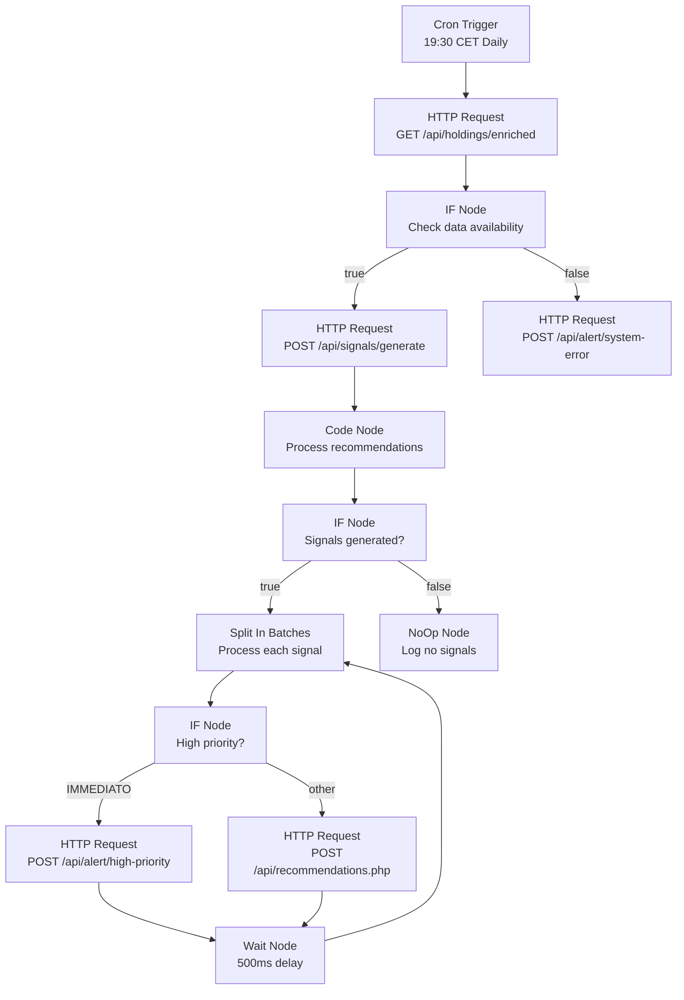
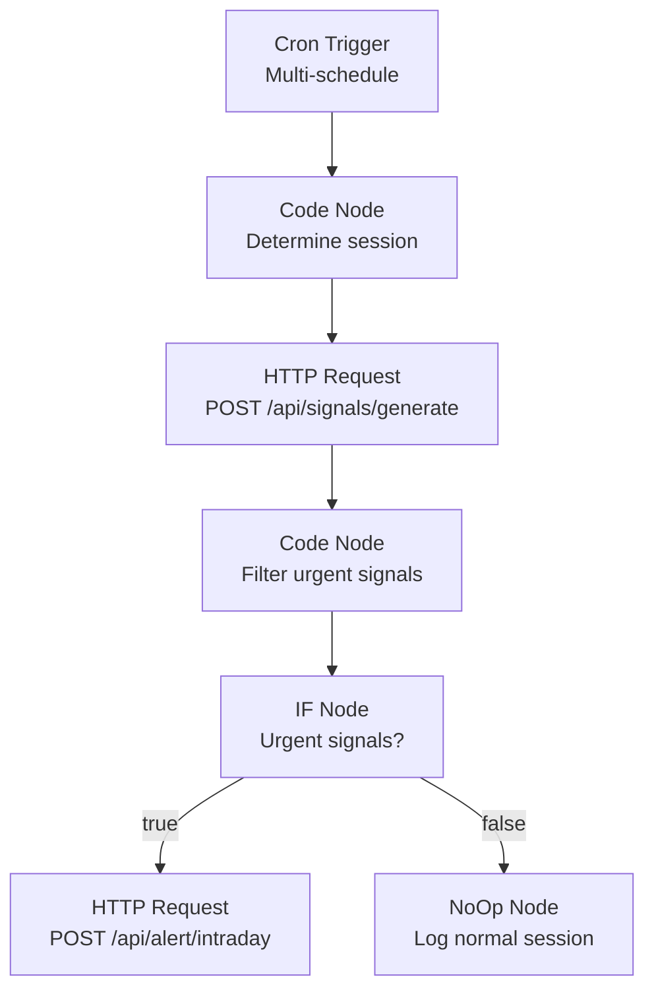
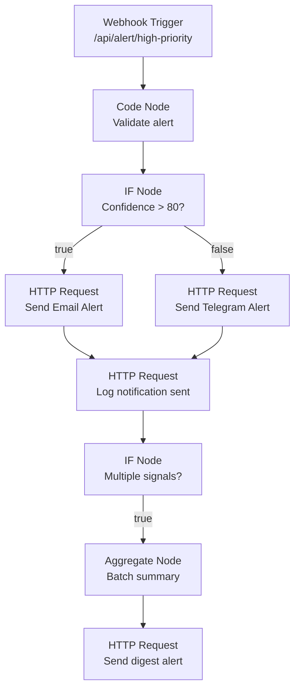
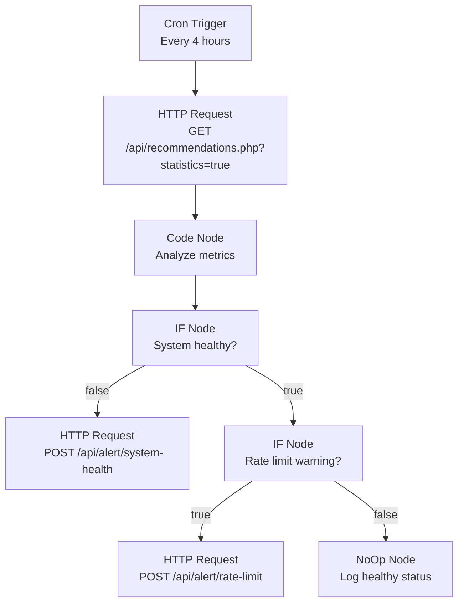

# 10 – Workflow n8n Phase 5: Automazione Segnali Trading

**Documentazione dei workflow n8n per l'automazione della generazione e gestione segnali di trading nella Fase 5**

**Prerequisiti**:
- n8n CE self‑hosted (Docker container `n8n`)
- API REST `/api/recommendations.php` implementata e funzionante
- SignalGeneratorService configurato e operativo
- Segreto HMAC condiviso con il backend PHP (configurato in `.env`)
- Accesso a dati di mercato (Yahoo Finance v8 preferito)

---

## 🎯 Panoramica Workflow Fase 5

### Workflow E – Generazione Automatica Segnali (Giornaliera)
**Trigger**: Ogni giorno alle 19:30 CET (dopo chiusura mercati europei)

### Workflow F – Schedulazione SignalGeneratorService (Personalizzata)
**Trigger**: Multi-orario: 08:00, 13:00, 18:00 CET

### Workflow G – Alert Notifiche Segnali Ad Alta Priorità
**Trigger**: Webhook da API quando viene creato segnale IMMEDIATO

### Workflow H – Monitoring e Health Check
**Trigger**: Ogni 4 ore + alert su failure

---

## 1. Workflow E – Generazione Automatica Segnali

**Obiettivo**: Eseguire SignalGeneratorService automaticamente per generare raccomandazioni basate su analisi tecnica e strategia Core-Satellite Risk Parity

**Trigger**: Schedulato ogni giorno alle 19:30 CET

### 1.1 Struttura workflow



### 1.2 Dettaglio nodi

#### Nodo 1: Cron Trigger
- **Type**: Schedule Trigger
- **Settings**:
  - Mode: Every Day
  - Time: 19:30
  - Timezone: Europe/Rome
  - Custom Cron: `30 19 * * *`

#### Nodo 2: HTTP Request (Recupera holdings arricchiti)
- **Method**: GET
- **URL**: `http://app:80/api/holdings.php`
- **Authentication**: HMAC (vedi sezione 5)
- **Query Parameters**:
  - `enriched=true`
  - `include_technical=true`
  - `active_only=true`

**JavaScript per preparare richiesta HMAC**:
```javascript
const webhookSecret = process.env.N8N_WEBHOOK_SECRET;
const timestamp = Date.now();
const payload = JSON.stringify({
    request_type: 'holdings_enriched',
    timestamp: timestamp,
    include_inactive: false
});

const signature = require('crypto')
    .createHmac('sha256', webhookSecret)
    .update(payload)
    .digest('hex');

return [{
    json: {
        headers: {
            'X-Webhook-Signature': 'sha256=' + signature,
            'X-Request-Timestamp': timestamp,
            'Content-Type': 'application/json',
            'User-Agent': 'n8n-workflow-signals/1.0'
        },
        body: payload
    }
}];
```

#### Nodo 3: IF (Check data availability)
- **Condition**: `{{ $json.data.length }}` > 0
- **True**: procedi con generazione segnali
- **False**: invia alert di errore

#### Nodo 4: HTTP Request (Chiama SignalGeneratorService)
- **Method**: POST
- **URL**: `http://app:80/lib/Services/SignalGeneratorService.php`
- **Headers**: HMAC come sopra
- **Body**:
```json
{
  "portfolio_id": 1,
  "analysis_type": "daily_generation",
  "market_session": "europe_close",
  "include_rebalance": true,
  "confidence_threshold": 60
}
```

#### Nodo 5: Code (Process recommendations)
```javascript
// Input: $json (risposta da SignalGeneratorService)
// Output: recommendations elaborate per batch processing

const recommendations = $json.recommendations || [];
const stats = {
    total: recommendations.length,
    by_urgency: {
        IMMEDIATO: recommendations.filter(r => r.urgency === 'IMMEDIATO').length,
        QUESTA_SETTIMANA: recommendations.filter(r => r.urgency === 'QUESTA_SETTIMANA').length,
        PROSSIME_2_SETTIMANE: recommendations.filter(r => r.urgency === 'PROSSIME_2_SETTIMANE').length,
        MONITORAGGIO: recommendations.filter(r => r.urgency === 'MONITORAGGIO').length
    },
    by_type: {
        BUY_LIMIT: recommendations.filter(r => r.type === 'BUY_LIMIT').length,
        SELL_PARTIAL: recommendations.filter(r => r.type === 'SELL_PARTIAL').length,
        SET_STOP_LOSS: recommendations.filter(r => r.type === 'SET_STOP_LOSS').length,
        SET_TAKE_PROFIT: recommendations.filter(r => r.type === 'SET_TAKE_PROFIT').length,
        REBALANCE: recommendations.filter(r => r.type === 'REBALANCE').length
    },
    avg_confidence: recommendations.reduce((sum, r) => sum + (r.confidence_score || 0), 0) / recommendations.length
};

// Log per monitoring
console.log(`Generated ${stats.total} recommendations:`, stats);

return recommendations.map(rec => ({
    json: {
        recommendation: rec,
        metadata: {
            generated_at: new Date().toISOString(),
            workflow_id: 'signal_generation_daily',
            batch_id: 'daily_' + new Date().toISOString().split('T')[0]
        }
    }
}));
```

#### Nodo 6: IF (Signals generated?)
- **Condition**: `{{ $json.length }}` > 0

#### Nodo 7: Split In Batches
- **Batch Size**: 1 (processa una raccomandazione alla volta)
- **Options**: Wait between batches = 500ms

#### Nodo 8: IF (High priority check)
- **Condition**: `{{ $json.recommendation.urgency }}` === 'IMMEDIATO'

#### Nodo 9: HTTP Request (Alert high priority)
- **Method**: POST
- **URL**: `http://app:80/api/alert/high-priority`
- **Body**: invia il segnale IMMEDIATO per notifica urgente

#### Nodo 10: HTTP Request (Salva raccomandazione)
- **Method**: POST
- **URL**: `http://app:80/api/recommendations.php`
- **Headers**: HMAC authentication
- **Body**: la raccomandazione completa

---

## 2. Workflow F – Schedulazione SignalGeneratorService Multi-Orario

**Obiettivo**: Eseguire SignalGeneratorService a orari specifici per catturare opportunità intraday

**Trigger**: Multi-orario: 08:00, 13:00, 18:00 CET

### 2.1 Struttura workflow



### 2.2 Configurazione Multi-Trigger

**Cron Expressions**:
- **Mattina**: `0 8 * * 1-5` (08:00, weekdays)
- **Pomeriggio**: `0 13 * * 1-5` (13:00, weekdays)
- **Sera**: `0 18 * * 1-5` (18:00, weekdays)

### 2.3 Code Node (Determine session)
```javascript
const hour = new Date().getHours();
let session_type, priority, include_rebalance;

if (hour === 8) {
    session_type = 'morning_pre_market';
    priority = 'overnight_gap_analysis';
    include_rebalance = false;
} else if (hour === 13) {
    session_type = 'midday_analysis';
    priority = 'intraday_opportunities';
    include_rebalance = false;
} else if (hour === 18) {
    session_type = 'evening_analysis';
    priority = 'setup_for_tomorrow';
    include_rebalance = true;
}

return [{
    json: {
        session_type: session_type,
        priority: priority,
        include_rebalance: include_rebalance,
        confidence_threshold: 70, // Più alto per sessioni intraday
        max_signals: 3 // Limita segnali per sessione
    }
}];
```

---

## 3. Workflow G – Alert Notifiche Segnali Ad Alta Priorità

**Obiettivo**: Gestire notifiche immediate per segnali IMMEDIATO e con alta confidence

**Trigger**: Webhook da API recommendations quando creato segnale urgente

### 3.1 Struttura workflow



### 3.2 Configurazione Alert

#### Email Alert (per confidence > 80%)
- **Provider**: Configurabile (Gmail, SMTP, ecc.)
- **To**: `{{ $env.ALERT_EMAIL_TO }}`
- **Subject**: `[URGENTE] Segnale Trading - {{ $json.recommendation.ticker }} - {{ $json.recommendation.type }}`
- **Template**:
```
Segnale di Trading Ad Alta Priorità

Ticker: {{ $json.recommendation.ticker }}
Tipo: {{ $json.recommendation.type }}
Urgenza: {{ $json.recommendation.urgency }}
Confidence: {{ $json.recommendation.confidence_score }}%

Dettagli:
- Prezzo trigger: {{ $json.recommendation.trigger_price }}
- Prezzo corrente: {{ $json.recommendation.current_price }}
- Razionale: {{ $json.recommendation.rationale_primary }}

Azione suggerita: {{ $json.recommendation.type }}
Scadenza: {{ $json.recommendation.expires_at }}

Visualizza nel portale: {{ $env.PORTAL_URL }}/recommendations/{{ $json.recommendation.id }}
```

#### Telegram Alert (per confidence 60-80%)
- **Bot Token**: `{{ $env.TELEGRAM_BOT_TOKEN }}`
- **Chat ID**: `{{ $env.TELEGRAM_CHAT_ID }}`
- **Message**: Versione breve del segnale

---

## 4. Workflow H – Monitoring e Health Check

**Obiettivo**: Monitorare salute sistema, verificare API funzionanti, controllare rate limits

**Trigger**: Ogni 4 ore (06:00, 10:00, 14:00, 18:00, 22:00 CET)

### 4.1 Struttura workflow



### 4.2 Health Check Metrics

#### Code Node (Analyze metrics)
```javascript
const stats = $json.data;
const health = {
    overall: true,
    issues: []
};

// Controlla se ci sono troppi segnali attivi
if (stats.active_count > 20) {
    health.overall = false;
    health.issues.push('Too many active signals: ' + stats.active_count);
}

// Controlla se ci sono segnali vecchi non eseguiti
if (stats.active_count > 0 && stats.avg_confidence_active < 50) {
    health.overall = false;
    health.issues.push('Low average confidence in active signals: ' + stats.avg_confidence_active);
}

// Controlla se il sistema sta generando segnali
if (stats.total_count === 0) {
    health.overall = false;
    health.issues.push('No signals generated in system');
}

return [{
    json: {
        health: health.overall,
        issues: health.issues,
        metrics: stats,
        timestamp: new Date().toISOString(),
        workflow_id: 'health_check'
    }
}];
```

---

## 5. Configurazione Sicurezza e HMAC

### 5.1 Variabili di ambiente n8n

Nel container n8n, configurare in **Settings > Variables**:

```bash
# API Keys
YAHOO_FINANCE_API_KEY=your_yahoo_key
ALPHA_VANTAGE_API_KEY=your_alpha_key
OPENAI_API_KEY=your_openai_key

# Security
N8N_WEBHOOK_SECRET=your_32_char_secret_key
API_BASE_URL=http://app:80
PORTAL_URL=https://your-portfolio-domain.com

# Alert Configuration
ALERT_EMAIL_TO=your-email@example.com
ALERT_EMAIL_FROM=noreply@your-domain.com
SMTP_HOST=smtp.gmail.com
SMTP_PORT=587
SMTP_USER=your-smtp-user
SMTP_PASS=your-smtp-password

# Telegram Alerts
TELEGRAM_BOT_TOKEN=your_bot_token
TELEGRAM_CHAT_ID=your_chat_id

# Rate Limiting
RATE_LIMIT_THRESHOLD=50
HEALTH_CHECK_INTERVAL=4_hours
```

### 5.2 Credenziali HMAC

Creare credenziali di tipo **HTTP Header** chiamata `HMAC Backend Auth`:

```javascript
// Pre-execution function per generare HMAC
const webhookSecret = process.env.N8N_WEBHOOK_SECRET;
const timestamp = Date.now();
const payload = JSON.stringify($json);

const signature = require('crypto')
    .createHmac('sha256', webhookSecret)
    .update(timestamp + ':' + payload)
    .digest('hex');

return {
    headers: {
        'X-Webhook-Signature': 'sha256=' + signature,
        'X-Request-Timestamp': timestamp,
        'Content-Type': 'application/json',
        'User-Agent': 'n8n-workflow-phase5/1.0'
    }
};
```

---

## 6. Testing e Validazione

### 6.1 Test Workflow E (Generazione Giornaliera)

```bash
# Test manuale via curl
curl -X POST "http://your-n8n:5678/webhook-test/signal-generation-daily" \
  -H "Content-Type: application/json" \
  -d '{"test": true, "portfolio_id": 1}'
```

### 6.2 Test Workflow G (Alert)

```bash
# Simula segnale ad alta priorità
curl -X POST "http://app:80/api/recommendations.php" \
  -H "Content-Type: application/json" \
  -d '{
    "type": "BUY_LIMIT",
    "holding_id": 1,
    "urgency": "IMMEDIATO",
    "confidence_score": 85,
    "trigger_price": 100.0
  }'
```

### 6.3 Verifica risultati

```sql
-- Verifica ultimi segnali generati
SELECT
    COUNT(*) as total_signals,
    COUNT(CASE WHEN urgency = 'IMMEDIATO' THEN 1 END) as urgent_signals,
    AVG(confidence_score) as avg_confidence,
    MAX(created_at) as last_generated
FROM recommendations
WHERE DATE(created_at) = CURDATE();
```

---

## 7. Monitoraggio e Alert

### 7.1 Dashboard Monitoring

Creare endpoint dedicato per monitoring:

```javascript
// GET /api/monitoring/n8n-status
{
    "workflows": {
        "signal_generation_daily": {
            "last_execution": "2025-12-02T19:30:05Z",
            "status": "success",
            "signals_generated": 8,
            "errors": 0
        },
        "intraday_analysis": {
            "last_execution": "2025-12-02T18:00:03Z",
            "status": "success",
            "signals_generated": 2,
            "errors": 0
        }
    },
    "alerts_sent": {
        "today": 3,
        "week": 12,
        "month": 45
    },
    "system_health": "healthy"
}
```

### 7.2 Error Handling

Configurare **Error Workflow** separato per ogni workflow principale:

```javascript
// Error Workflow: Log e Notifica
const error = $json.error;
const workflowName = $json.workflow.name;
const executionId = $json.executionId;

// Log dettagliato
console.error(`Workflow ${workflowName} failed:`, error);

// Invia notifica email se necessario
if (error.severity === 'high' || error.retry_count > 3) {
    // Invia email di alert
    $node['Send Email'].execute({
        to: process.env.ALERT_EMAIL_TO,
        subject: `[CRITICAL] Workflow ${workflowName} failed`,
        body: `Error details: ${JSON.stringify(error, null, 2)}`
    });
}
```

---

## 8. Manutenzione e Best Practices

### 8.1 Rotazione Chiavi API
- **Yahoo Finance**: Rotazione mensile
- **Alpha Vantage**: Rotazione trimestrale
- **OpenAI**: Monitorare usage e costi

### 8.2 Backup Configuration
Esportare configurazioni workflow regolarmente:
```bash
# Export via n8n API
curl -X GET "http://n8n:5678/api/workflows" \
  -H "X-N8N-API-KEY: your-n8n-api-key" \
  > n8n_workflows_backup_$(date +%Y%m%d).json
```

### 8.3 Performance Optimization
- Batch size ottimizzato per API rate limits
- Wait time configurabile via environment variables
- Retry logic con exponential backoff

---

**File:** `/docs/10-N8N-WORKFLOWS-PHASE5.md`
**Aggiornato:** 02 Dicembre 2025
**Versione:** 1.0.0 - Fase 5 Automation

---

## Prossimi Step

Dopo aver implementato questi workflow, la **Fase 6** sarà l'integrazione frontend per visualizzare e gestire i segnali generati automaticamente.